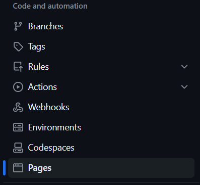
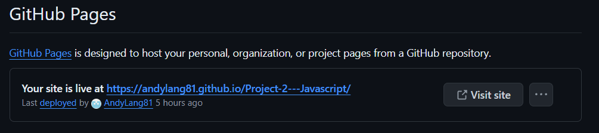

# Rock Paper Scissors Lizard Spock

[\[Link to live project\]](https://github.com/AndyLang81/Project-2---Javascript)

## Description

Rock Paper Scissors Lizard Spock is a web-based game inspired by the popular game featured in the TV show "The Big Bang Theory". It offers an exciting twist on the classic Rock Paper Scissors game by introducing two additional options: Lizard and Spock. The game is designed to be simple yet engaging, providing hours of fun for players of all ages.

## Features & Game mechanics

#### Choices
Players can choose from five options: rock, paper, scissors, lizard, or spock.

#### Winning Combinations
Each choice has specific combinations it can defeat. For example, rock crushes scissors and lizard, while paper covers rock and disproves spock.

#### Scoring
When a player wins a round by selecting a choice that defeats the opponent's choice, their score increases. Conversely, if the opponent wins, their score increases.

#### Victory Condition
The game continues until one player reaches the winning score, set at 10 points.

#### Display and Interaction
The game interface allows players to make selections through clickable buttons and displays the computer's choice. After each round, the outcome is displayed, and scores are updated accordingly.

## User stories

When the user opens the site, they will see the five different pictures representing player choices to start the game. 

Upon selecting one, user will play their hand and the computer will select an input at random.

After selection, the system will inform the user of the computer's choice.

At the same time, the user will be informed of how their choice interacts with the computer's choice. 

In the event that the computer makes the same selection as the user, the game will result in a tie. 

Once a winner has been selected, user will see a point added to the scoreboard of the most recent round winner. 

Once the user or the computer will reach 10 wins, the game ends, and a message is displayed in the browser, announcing the winnner.

## Technology:

The project structure is built in HTML using Gitpod.
Visuals are built in CSS Gitpod.
Game logic is built in Javascript Gitpod.
The site is deployed via Github.

## Deployment

The site is deployed with GitHub.

The link to the repository can be found [here](https://andylang81.github.io/Project-2---Javascript/)

The live page can be found by going to the top bar and selecting Settings > Pages > GitHub Pages.

Steps to deploy: Upon opening the dashboard, user should see their active repositories on the profile.

Upon selecting the repository in question (Project-2---Javascript), user should see the bar with general options in the top portion of the screen. 

User should click on "Settings" which opens the General page with a column of options on the left hand side.

Here, user should click on "Pages", which will open the page "GitHub Pages" and find the section in the main screen labelled "Build and deployment."

After ensuring main and /root are selected and clicking "Save" user will see their deployed pages in the section above labelled "GitHub Pages."

Clicking the link in the box will lead the user to the live site.

## Neon Glow Effect
Neon effect tutorial adapted from https://www.w3schools.com/

## Burger Menu
Burger menu repurposed from the Love Running project

## Future Implementations

### Enhanced Winner Descriptions
To improve the user experience, consider implementing a dictionary in JavaScript to provide more descriptive winner descriptions. For example, instead of simply stating "Rock beats Scissors," the game could display "Rock crushes Scissors" or "Lizard poisons Spock," adding a layer of thematic immersion to the gameplay.

### Additional Visual Effects
Explore adding more visual effects and animations to enhance the game's aesthetics and engagement. This could include particle effects, transitions, or dynamic backgrounds to create a more immersive experience for players.

## Testing

The web app has been thoroughly tested across various screen sizes using media queries to ensure a consistent and responsive user experience. Testing was conducted on PC, tablet, and mobile screens to verify the following:

- **PC Screens**: The web app was tested on desktop monitors with various resolutions to ensure optimal layout and functionality across widescreen displays.
  
- **Tablet Screens**: Testing was performed on tablet devices
to verify responsiveness and usability on devices with medium-sized screens.

- **Mobile Screens**: Extensive testing was carried out on smartphones of different makes and models to ensure that the web app is fully functional and visually appealing on small screens. Attention was given to touch interactions, readability, and navigation on mobile devices.

The responsive design of the web app allows it to adapt seamlessly to different screen sizes, providing an optimal viewing and interaction experience for users across a wide range of devices.

## Deployment

The web app is deployed using [GitHub Pages](https://pages.github.com/), making it accessible to users via a public URL. Continuous deployment practices ensure that any updates or changes made to the codebase are automatically reflected in the live version of the app.

## validation
W3C CSS validator : [results](https://jigsaw.w3.org/css-validator/validator?uri=https%3A%2F%2Fandylang81.github.io%2FProject-2---Javascript%2F&profile=css3svg&usermedium=all&warning=1&vextwarning=&lang=en)

W3C HTML validator : [results](https://validator.w3.org/nu/?doc=https%3A%2F%2Fandylang81.github.io%2FProject-2---Javascript%2F)

Javascript passes throug JShint.com without major issues.

## Credits
Thanks to my mentor, Rohit, for good guidance.

### Content
Game descriptions and text generated with ChatGPT.

### Media Sources

Images: Generated via Bing Image Creator.

